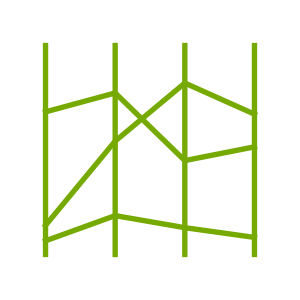

### mocoords

> "Parallel coordinate charts are just so dang useful"

This project is incredibly early right now, but the goal is to allow for an interactive widget like below:

The selections that you make can be sent back to Python, allowing you to make complex selections for bulk labelling on your embeddings. To give this a proper spin yourself you should be able to use the [WASM environment on Github Pages](https://koaning.github.io/mocoords/). 
